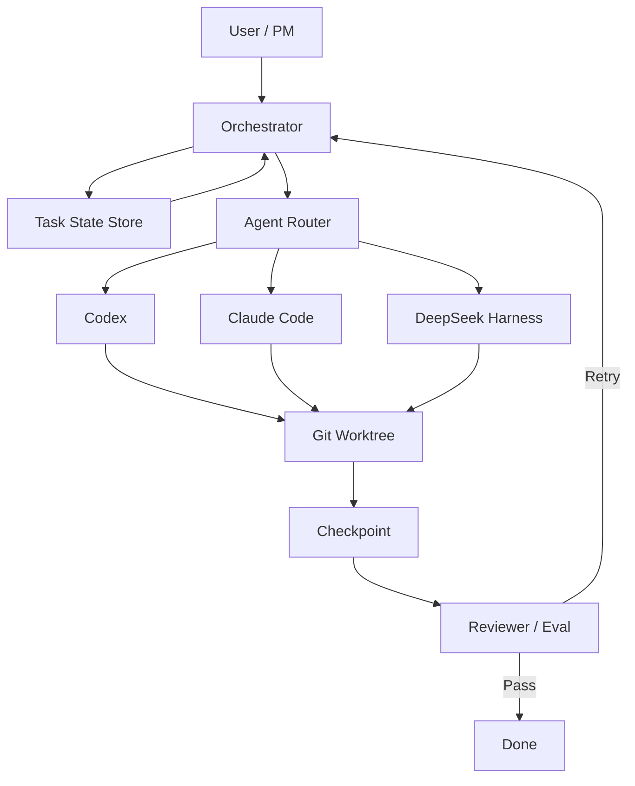

## 01 今日一句话

今天最值得关注的不是某一个新模型，而是 **AI Coding 正在从“一个 Agent 会写代码”进入“Agent Harness + 可复用 Skill + Context 管理 + 多 Agent 编排”阶段**：DeepSeek Harness、OpenAI Skills、Context Mode、Ruflo 等项目分别在运行时、能力封装、上下文治理和多 Agent 协作上补齐基础设施；与此同时，近期 Coding Agent 的 sandbox / Git 配置漏洞也说明，下一阶段真正的门槛会从“能不能自动写代码”转向“能不能安全、可恢复、可审计地长期执行”。

## 02 今日 TOP 5

| 排名 | 项目 / 技术 | 类型 | 当前热度 | 近期变化 | 为什么重要 | 评级 | 是否立即研究 |
|---|---|---|---:|---|---|---|---|
| 1 | [deepseek-ai/deepseek-harness](https://github.com/deepseek-ai/deepseek-harness) | Agent Harness | 217,168 Stars | 8 月中旬创建，仍高速增长 | 把模型、工具、Skill、Session、Sandbox、Storage、Loop、Scheduler、UI 都抽象成插件，代表 Harness 层独立成平台 | S | YES |
| 2 | [openai/skills](https://github.com/openai/skills) | Agent Skills | 26,741 Stars | 9/8 仍有提交，第三方 Trending 快照显示继续升温 | “能力文件夹化 / 可分发化”正在成为 Agent 工程的重要接口层 | S | YES |
| 3 | [mksglu/context-mode](https://github.com/mksglu/context-mode) | Context Engineering / MCP | 21,612 Stars | 9/8 仍有提交；第三方 Trending 快照显示快速增长 | 直接处理 Tool Output 挤占上下文的问题，把 Context 当作运行资源治理 | A | YES |
| 4 | [ruvnet/ruflo](https://github.com/ruvnet/ruflo) | Multi-Agent Meta-Harness | 71,756 Stars | 9/9 仍有提交 | 将 Claude Code / Codex / 其他 Agent 纳入同一编排层，关注 swarm、memory、MCP、工作流 | A | YES |
| 5 | [shareAI-lab/learn-claude-code](https://github.com/shareAI-lab/learn-claude-code) | Harness 教学 | 76,408 Stars | 项目成熟、学习价值仍高 | 用极小实现解释 Coding Agent Harness 内部结构，非常适合理解“Agent = Model + Harness” | A | YES |

> 注：Stars 为 2026-09-09 查询 GitHub API 的当前值。所谓“近期增长”在没有可靠历史快照时不伪造精确 24h 增量；第三方 Trending 页面只作为方向性热度信号。

## 03 GitHub AI Radar

### 1. DeepSeek Harness

- GitHub：[deepseek-ai/deepseek-harness](https://github.com/deepseek-ai/deepseek-harness)
- Stars：**217,168**
- Forks：**25,672**
- 创建时间：2026-08-13
- 最近推送：2026-09-08
- 定位：开源 Agent Harness，核心口号是 **Everything is a Plugin**。
- 核心创新：Cordis 内核只负责插件加载、卸载与依赖；模型、工具、技能、会话、沙箱、存储、循环、调度和 UI 都作为插件组合。
- 为什么值得关注：它把“Agent 产品”拆成“可组合 Agent Runtime”，这比单纯做一个 Claude Code 替代品更有长期工程价值。
- 风险：仍处于 Developer Preview；兼容性会破坏性变化。9 月 9 日公开披露的 CVE-2026-82533 也说明 Harness 的权限边界必须作为一级设计对象。
- 评分：**94/100，S**。

### 2. OpenCode

- GitHub：[anomalyco/opencode](https://github.com/anomalyco/opencode)
- Stars：**206,081**
- Forks：**26,918**
- 最近推送：2026-09-09
- 定位：开源 Coding Agent。
- 核心价值：模型选择开放、终端/IDE 使用、Agent / Subagent 机制、快速版本迭代。
- 今日信号：仓库当天仍持续提交；其容器包 1.18.17 在当天发布，说明项目交付节奏非常活跃。
- 值得借鉴：Coding Agent 不再只是聊天 UI，而是项目浏览、规划、工具调用、权限和子 Agent 的工作台。
- 风险：项目安全文档明确说明其 Agent 默认并不是传统意义上的强隔离 sandbox，使用不可信仓库时必须额外控制权限。
- 评分：**89/100，A**。

### 3. OpenAI Codex

- GitHub：[openai/codex](https://github.com/openai/codex)
- Stars：**122,765**
- Forks：**18,872**
- 最近推送：2026-09-09
- 最近稳定 Release：**0.153.4（2026-09-04）**
- 定位：运行于终端的轻量 Coding Agent，主体为 Rust。
- 为什么值得关注：Codex 已经从“模型入口”演进成完整的软件工程执行面，Skills、插件、沙箱、CLI、远程任务等能力逐步形成生态。
- 今日方法论价值：观察 Codex 时重点不应只看模型效果，而应看 Skill、工具权限、状态、任务交付格式如何标准化。
- 评分：**92/100，S**。

### 4. OpenAI Skills

- GitHub：[openai/skills](https://github.com/openai/skills)
- Stars：**26,741**
- Forks：**1,793**
- 最近推送：2026-09-08
- 定位：Codex 的 Skills Catalog。
- 核心思想：**Write once, use everywhere**——把指令、脚本、资源组织成可发现、可安装、可复用的能力单元。
- 为什么重要：Skill 很可能成为 Agent 世界里类似“Package / Library”的上层能力分发单位。
- 对个人最有价值：你可以把“模块分析、代码审查、ESD→PICA 迁移、故障排查、交易新闻分析”等长期 Prompt 进一步升级成结构化 Skill，而不是一直保存一大段 Prompt。
- 评分：**93/100，S**。

### 5. Context Mode

- GitHub：[mksglu/context-mode](https://github.com/mksglu/context-mode)
- Stars：**21,612**
- Forks：**1,555**
- 最近推送：2026-09-08
- 定位：通过 MCP + hooks 对 Coding Agent 的 context window 进行治理。
- 项目宣称：通过把大量工具原始输出放入 sandbox，仅将压缩后的必要信息返回模型，可大幅降低 Context 消耗；其 README 展示了最高约 98% 的工具输出缩减案例。
- 核心价值：**Context 不再是 Prompt 字符串，而是一种需要预算、路由、存储和生命周期管理的系统资源。**
- 风险：98% 是项目方场景数据，不应直接当作所有工作负载的统一效果；同时已有 CPU busy-loop 等公开 Issue，需要关注运行稳定性。
- 评分：**88/100，A**。

### 6. Ruflo

- GitHub：[ruvnet/ruflo](https://github.com/ruvnet/ruflo)
- Stars：**71,756**
- Forks：**8,493**
- 最近推送：2026-09-09
- 定位：Agent Meta-Harness / Multi-Agent Orchestration。
- 能力重点：swarm、memory、RAG、MCP、skills、Claude Code / Codex / Hermes 集成。
- 为什么值得关注：它对应一个越来越现实的需求——**不要把业务流程绑死在 Claude Code 或 Codex 单个 Agent 上，而是在更高层管理任务、状态、模型和失败转移。**
- 风险：功能范围很大，容易出现“平台复杂度先于真实需求”的问题；研究时优先看任务状态、handoff、memory 和 orchestration，不必一次吃完整套生态。
- 评分：**86/100，A**。

### 7. learn-claude-code

- GitHub：[shareAI-lab/learn-claude-code](https://github.com/shareAI-lab/learn-claude-code)
- Stars：**76,408**
- Forks：**12,294**
- 最近推送：2026-08-26
- 定位：从 0 到 1 构建一个 nano Claude Code-like Agent Harness。
- 核心价值：不是追求生产级功能，而是让开发者理解 Agent Loop、Tool、Shell、文件系统、上下文等基本模块如何拼起来。
- 对学习最重要：如果只看成熟框架，很容易“会用但不懂”；这个项目非常适合作为 Harness 的源码入门。
- 评分：**90/100，A**。

### 8. i-have-adhd

- GitHub：[ayghri/i-have-adhd](https://github.com/ayghri/i-have-adhd)
- Stars：**33,139**
- Forks：**1,964**
- 最近推送：2026-09-08
- 定位：一个约束 Coding Agent 输出方式的可安装 Skill。
- 核心规则：行动优先、步骤编号、抑制无关扩展、每轮重申当前状态、给出明确下一步等。
- 为什么有方法论价值：它证明 Skill 不一定是“调用复杂 API”，也可以是**稳定改变 Agent 行为策略的规则包**。
- 评分：**82/100，A（学习价值高于功能复杂度）**。

## 04 Emerging Projects

### Emerging 1：OpenAI Skills

**为什么可能继续火：**

1. 来自官方，天然能跟 Codex 分发链路结合。
2. Skill 的抽象足够轻，不要求团队先部署复杂 Agent 平台。
3. 团队可以把 SOP、脚本、模板和验收规则一起打包，而不是只有 Prompt。
4. 非常适合企业内部沉淀“可执行知识”。

**证伪条件：**如果不同 Agent 平台长期无法形成可迁移的 Skill 标准，各家 Skill 变成私有插件格式，生态价值会明显下降。

### Emerging 2：Context Mode

**为什么可能继续火：**

Agent 执行越长，真正的瓶颈越容易从模型能力变成 Context 污染、压缩遗忘、Tool Output 爆炸和成本。Context Mode 正好切的是长任务痛点。

**证伪条件：**如果主流 Agent Runtime 内建更强的 Context virtualization / memory / tool-result store，这类外置 MCP sidecar 的价值可能下降。

### Emerging 3：i-have-adhd

**为什么值得观察：**

它说明市场已经开始关注“Agent 输出纪律”本身。未来会出现越来越多针对 Review、Debug、Research、Planning、Incident Response 的行为型 Skills。

**证伪条件：**如果模型原生可稳定遵守短输出、状态持续和任务规范，不再需要额外 Skill，这类项目价值会下降。

## 05 今日最值得深挖的项目

### A. DeepSeek Harness：把 Agent 从产品拆成 Runtime

传统思路常常是：

```text
模型
  ↓
写一个 Agent Loop
  ↓
绑死一组 Tools
  ↓
加一点 Memory / UI
  ↓
形成一个产品
```

DeepSeek Harness 更接近：

```text
                 Cordis Kernel
                      │
      ┌───────────────┼────────────────┐
      ▼               ▼                ▼
   Model Plugin    Tool Plugin      Skill Plugin
      │               │                │
      ├───────────────┼────────────────┤
      ▼               ▼                ▼
 Session Plugin   Sandbox Plugin   Storage Plugin
      │               │                │
      └───────────────┼────────────────┘
                      ▼
                Loop / Scheduler
                      │
                      ▼
                     UI
```

**最值得借鉴的不是插件数量，而是边界：**Kernel 不承担具体 Agent 能力，只承担依赖和生命周期。这样 Claude、Codex、DeepSeek、不同工具和不同存储都有机会替换。

如果自己做简化版，先实现 5 个模块：

1. `AgentRuntime`：负责一次任务生命周期。
2. `ToolRegistry`：工具注册、权限和调用。
3. `SessionStore`：上下文和执行状态。
4. `CheckpointStore`：可恢复进度。
5. `PluginSPI`：模型、工具、memory、scheduler 的扩展接口。

这套思路非常适合多 Agent 软件研发平台。

### B. OpenAI Skills：从 Prompt 资产升级为 Executable Knowledge

过去知识沉淀通常是：

```text
Prompt.md
```

但一个真正可复用的工程能力往往还需要：

```text
Skill/
├── SKILL.md
├── scripts/
├── templates/
├── examples/
├── references/
└── tests-or-evals/
```

这带来一个关键变化：

> **团队知识不只是“告诉 AI 怎么做”，而是“把做事方法、工具、产物格式和验证手段一起封装”。**

对你最值得迁移的是把现有长期 Prompt 转成 Skills，例如：

- Java 模块深度分析 Skill
- ESD→PICA 迁移 Skill
- 线上故障排查 Skill
- GitHub 新项目调研 Skill
- AI 前沿日报 Research Skill

## 06 Methodology Radar

### 1. Harness-first Design

**是什么：**把模型看成可替换推理引擎，把 Tool、Memory、State、Sandbox、Scheduler、UI 放在 Harness 层。

**解决问题：**模型额度耗尽、供应商切换、长任务恢复、多 Agent 管理、工具权限。

**为什么现在值得学：**Coding Agent 已从“对话辅助”进入长任务执行阶段，Agent Runtime 的稳定性比单轮 Prompt 更重要。

**适合：**AI 软件研发团队、自动化运维、研究 Agent、跨模型执行。

**不适合：**一次性简单问答；为了“多 Agent”而多 Agent。

### 2. Skill-as-Executable-Knowledge

**是什么：**把 SOP、Prompt、脚本、资源、模板、示例和约束封装成能力单元。

**解决问题：**经验散落在聊天记录；同一任务每次都重新 Prompt；不同成员输出不一致。

**实践：**先从一个已有 Prompt 做 Skill，不要一开始造平台。

### 3. Context Budgeting / Context Virtualization

**是什么：**Tool 原始结果不全部进入 LLM 上下文；用外部存储、sandbox、索引和压缩保留信息，仅把当前决策需要的信息送给模型。

**解决问题：**长任务 context overflow、compaction 遗忘、token 成本和噪音。

**典型项目：**Context Mode，以及各 Agent Runtime 的 memory / tool-result store。

### 4. Agent Security Boundary

近期两个信号很重要：

- DeepSeek Harness 的 CVE-2026-82533 暴露了 Agent 可通过本地 Web 接口改变 sandbox 状态的风险，该问题已在 8 月 27 日修复后于 9 月公开披露。
- Manifold Security 披露了多款 Coding Agent 对仓库 `.git` 配置的信任问题，一些工具已修复。

**方法论：**Sandbox 不是 UI 开关，而必须是 Agent 无法自行修改的外部安全边界；Repository 本身也属于不可信输入。

## 07 Skill Radar

### Skill Card 1：OpenAI Skills / SKILL.md 模式

- 类型：Agent Skill 标准化
- 来源：[openai/skills](https://github.com/openai/skills)
- 解决问题：将重复工作流打包为可发现、可安装能力
- 输入：任务 + Skill 目录
- 输出：按 Skill 规则执行后的标准产物
- 核心思想：Instructions + Scripts + Resources，而非只有 Prompt
- 适合：代码 Review、文档、研发 SOP、Research
- 不适合：极短、一次性任务
- 可迁移：Codex **YES**；Claude Code **可按类似目录思想迁移**；ChatGPT **可迁移方法论**；OpenCode **可适配**
- 难度：Medium
- 学习价值：★★★★★
- 建议收藏：YES
- 建议自己实现：YES
- 30 分钟实验：把现有“Java 模块分析 Prompt”拆成 `SKILL.md + output-template.md + checklist.md`。

### Skill Card 2：Context Mode

- 类型：MCP / Context Engineering Skill
- 来源：[mksglu/context-mode](https://github.com/mksglu/context-mode)
- 解决问题：工具输出占满上下文、压缩后丢失任务状态
- 核心思想：原始结果留在外部执行/存储侧，只返回摘要与引用
- 输入：MCP / Tool 调用结果
- 输出：压缩后的可决策 Context
- 适合：大量日志、GitHub Issues、Browser snapshots、长任务
- 不适合：短对话、工具输出很小的场景
- 可迁移：Claude Code / Codex / OpenCode 等支持 MCP 或 hooks 的平台
- 难度：Medium
- 学习价值：★★★★★
- 建议收藏：YES
- 建议自己实现：YES（先做简化版）
- 30 分钟实验：写一个 Tool Wrapper，把 5,000 行日志存文件，只返回错误聚类 + 行号引用。

### Skill Card 3：i-have-adhd

- 类型：Behavior / Output Skill
- 来源：[ayghri/i-have-adhd](https://github.com/ayghri/i-have-adhd)
- 解决问题：Agent 输出冗长、下一步不明确、状态容易丢失
- 核心思想：把“沟通规范”也当成可安装 Skill
- 输入：普通 Coding Task
- 输出：行动优先、编号步骤、状态明确的回复
- 可迁移：Claude Code YES；Codex YES；其他 Agent 可通过 rules/skills 机制适配
- 难度：Low
- 学习价值：★★★★☆
- 建议收藏：YES
- 建议自己实现：YES
- 30 分钟实验：为你的 ESD→PICA Agent 写一个 `handoff-discipline` Skill，强制每次输出 `DONE / DOING / BLOCKED / NEXT`。

## 08 Architecture Pattern

### External Task State + Pluggable Agent Runtime

今天最值得沉淀的架构不是“让多个 Agent 互聊”，而是：



关键原则：

1. **Agent Session ≠ Task State**。
2. Git / Task Store / Checkpoint 才是真实状态源。
3. Claude/Codex 只是可替换 Worker。
4. 额度耗尽时切 Agent，不丢任务进度。
5. Skill 决定“怎么做”，Harness 决定“如何可靠执行”。

## 09 我今天应该学什么

### MUST LEARN：自己实现一个最小 Agent Harness

今天最值得花 30～60 分钟的不是安装 8 个项目，而是理解 Harness 到底是什么。

**学习顺序：**

1. 先读 [DeepSeek Harness README](https://github.com/deepseek-ai/deepseek-harness)，只关注 Cordis、Plugin、Tool、Session、Sandbox。
2. 再读 [learn-claude-code](https://github.com/shareAI-lab/learn-claude-code)，看最小 Agent Loop 如何工作。
3. 自己写一个极简版本：`LLM → tool_call → shell/file → result → LLM`。
4. 再加一个 `checkpoint.json`，让任务中断后能继续。
5. 最后再思考如何接入 Claude Code / Codex CLI，而不是一开始造复杂 Multi-Agent 平台。

**今天真正要理解的源码概念：**Agent Loop、Tool Registry、Session、Permission/Sandbox、Checkpoint。

## 10 Watchlist

今天是该栏目首次建立基线，因此暂时没有本站前一日快照；从明天开始可以用历史日报中的 Stars 做变化比较。

| 项目 | 2026-09-09 基线 Stars | 最近推送 | 趋势 | 观察理由 |
|---|---:|---|---|---|
| deepseek-ai/deepseek-harness | 217,168 | 09-08 | 🔥 Exploding | 新项目体量巨大，插件生态和安全边界都值得持续跟踪 |
| anomalyco/opencode | 206,081 | 09-09 | ↑ Accelerating | 开源 Coding Agent 高活跃度 |
| openai/codex | 122,765 | 09-09 | ↑ Accelerating | 官方 Coding Agent / Skill 生态主线 |
| shareAI-lab/learn-claude-code | 76,408 | 08-26 | → Stable | 学习型项目，长期价值大于短期热度 |
| ruvnet/ruflo | 71,756 | 09-09 | ↑ Accelerating | 多 Agent / meta-harness 方向 |
| ayghri/i-have-adhd | 33,139 | 09-08 | ↑ Accelerating | 行为型 Skill 的代表样本 |
| openai/skills | 26,741 | 09-08 | ↑ Accelerating | Skill 分发标准值得重点跟踪 |
| mksglu/context-mode | 21,612 | 09-08 | ↑ Accelerating | Context Engineering 进入工具化阶段 |

## 11 Noise Filter

### 1. 仅仅“套一个模型 API + 做漂亮 Web UI”的新项目

**SKIP。** 如果没有新的 Tool / Context / State / Eval / Workflow / Runtime 设计，只是换模型 Wrapper，学习价值通常不高。

### 2. 只宣传“100 个 Agent 并发”，但没有 Task State / Eval / Failure Recovery 的 Swarm 项目

**谨慎。** Agent 数量不是能力指标。没有状态机、可观测性、失败处理和真实 Benchmark，多 Agent 很可能只增加成本和不确定性。

### 3. 宣称超高 token 节省但没有可复现实验的数据

**谨慎。** Context Mode 的思路值得学，但类似“节省 98%”的数字必须理解测试输入和基线，不应直接外推到所有任务。

### 4. 默认对本机文件 / Shell / Git 配置拥有过大信任的 Coding Agent

**高风险。** 最近的安全披露再次证明：不可信仓库可能成为 Prompt Injection 和命令执行入口。

## 12 最终行动清单

### TODAY

1. **学习 Harness：** DeepSeek Harness + learn-claude-code。
2. **学习 Skill 封装：** openai/skills，尝试把一个现有 Prompt 改成 Skill。
3. **做一个 Context 实验：** Tool 输出不直接进入模型，改为文件存储 + 摘要 + 引用。

### WATCH

4. Ruflo：重点看 Task State / Handoff / Memory，而不是“Agent 数量”。
5. Context Mode：持续看稳定性、CPU / hooks 问题和更多平台集成。
6. OpenCode / Codex：跟踪权限、安全、Skill 和子 Agent 机制。

### SKIP

7. 没有工程创新的纯 API Wrapper。
8. 没有 Eval / Checkpoint / State 的“炫技型 Multi-Agent Swarm”。

## Sources

- GitHub API / Repository：<https://github.com/deepseek-ai/deepseek-harness>
- DeepSeek Harness 官方：<https://deepseek.com/harness/>
- GitHub：<https://github.com/anomalyco/opencode>
- GitHub：<https://github.com/openai/codex>
- GitHub：<https://github.com/openai/skills>
- GitHub：<https://github.com/mksglu/context-mode>
- GitHub：<https://github.com/ruvnet/ruflo>
- GitHub：<https://github.com/shareAI-lab/learn-claude-code>
- GitHub：<https://github.com/ayghri/i-have-adhd>
- DeepSeek Harness CVE 报道（2026-09-09）：<https://thehackernews.com/2026/09/deepseek-harness-flaw-let-ai-agents.html>
- Coding Agent `.git` 配置安全问题（2026-09-02）：<https://thehackernews.com/2026/09/malicious-git-configs-can-make-claude.html>
- 2026-09-09 GitHub Trending 第三方快照（用于方向性热度，不作为官方 Star 历史）：<https://startupcorners.com/digest/devtools-digest-2026-09-09>
