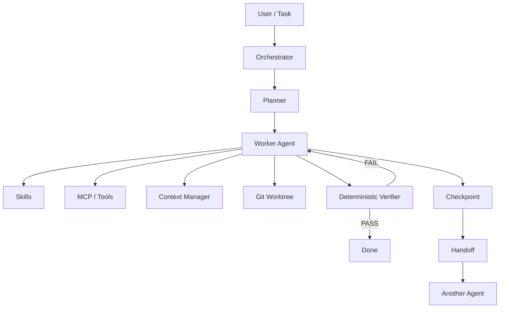

## 01 今日一句话

今天最值得关注的不是“又出了一个聊天机器人”，而是 AI 工程正在明显从单体 Coding Agent 转向 **Harness + Skills + MCP + Context Engineering + 多 Agent 编排 + 可验证工作流**。如果你今天只学一个方向，优先研究“Agent Harness 如何把模型、工具、技能、状态、检查点和工作流组合成稳定系统”。

## 02 今日 TOP 5

| 排名 | 项目 / 技术 | 类型 | 近期信号 | 为什么重要 | 评级 |
|---|---|---|---|---|---|
| 1 | deepseek-ai/deepseek-harness | Agent Harness | 近期持续高速增长，社区关注极高 | “Everything is a plugin” 把 Agent Runtime 做成可扩展插件系统 | S |
| 2 | openai/skills | Skills | 今日趋势榜高位 | 官方 Skills Catalog，代表能力模块化正在成为 Agent 的标准组织方式 | S |
| 3 | mksglu/context-mode | Context Engineering / MCP | 今日新增关注显著 | 把工具输出隔离、压缩和按需加载，直接解决 Agent 上下文膨胀 | A |
| 4 | ruvnet/ruflo | Multi-Agent Meta Harness | 今日持续升温 | 把 Claude Code、Codex 等运行时纳入统一多 Agent 编排 | A |
| 5 | shareAI-lab/learn-claude-code | Learning Harness | 今日趋势关注 | 用最小实现拆解 Claude Code 类 Agent 内核，适合学习 Harness 原理 | A |

> 注：GitHub Star 与短期增量实时变化很快；本报告更看重趋势、工程设计和学习价值，不把 Star 当成唯一判断标准。

## 03 GitHub AI Radar

### 1. DeepSeek Harness

- 仓库：https://github.com/deepseek-ai/deepseek-harness
- 类型：Agent Harness / Coding Agent Runtime
- 核心定位：用插件架构组织 Agent 的工具、计划、子 Agent、工作流和执行环境。
- 核心创新：`Everything is a plugin`，让能力不是硬编码在 Agent 主循环，而是按插件扩展。
- 为什么值得关注：这比“写一段超级 Prompt”更接近真正的软件架构；模型可替换，Harness 才是长期资产。
- 学习价值：★★★★★
- 评级：S

### 2. OpenAI Skills

- 仓库：https://github.com/openai/skills
- 类型：Agent Skills
- 核心定位：Codex Agent 的官方 Skills Catalog。
- 核心思想：把可复用的方法、流程、工具调用约束做成独立 Skill，而不是塞进一个超长 Prompt。
- 为什么值得关注：Skill 正在成为跨任务复用 Agent 能力的重要抽象。
- 学习价值：★★★★★
- 评级：S

### 3. context-mode

- 仓库：https://github.com/mksglu/context-mode
- 类型：Context Engineering / MCP
- 核心定位：减少 Coding Agent 工具输出直接污染上下文窗口。
- 核心思想：大块输出先进入沙箱或中间层，Agent 只取真正需要的片段。
- 方法论价值：**上下文不是越多越好，而是要管理信息密度。**
- 学习价值：★★★★★
- 评级：A

### 4. Ruflo

- 仓库：https://github.com/ruvnet/ruflo
- 类型：Multi-Agent / Meta Harness
- 核心定位：在 Claude Code、Codex 等 Coding Agent 上层做多 Agent 协作、Memory、RAG 和工作流。
- 为什么值得关注：它代表“单 Agent 工具”继续往“Agent Runtime / Orchestrator”演进。
- 对你的价值：与你正在设计的多智能体研发编排、Checkpoint、Handoff、Failover 很接近。
- 学习价值：★★★★☆
- 评级：A

### 5. learn-claude-code

- 仓库：https://github.com/shareAI-lab/learn-claude-code
- 类型：Agent Harness Learning
- 核心定位：用小型实现解释 Claude Code 类型工具的内部工作机制。
- 为什么值得学：相比直接读一个几十万行的大型 Agent 项目，这种最小实现更适合理解 Tool Loop、上下文、执行器和 Agent 主循环。
- 学习价值：★★★★★
- 评级：A

### 6. Harness Skills

- 仓库：https://github.com/harness/harness-skills
- 类型：Skills + MCP + CI/CD
- 核心定位：让 Claude Code、Cursor、GitHub Copilot 等通过结构化 Skills 操作 Harness CI/CD。
- 值得关注的点：它不是“提示词合集”，而是 `AGENTS.md + SKILL.md + MCP Tools` 组成的工作流系统。
- 方法论价值：Skill 负责方法，MCP 负责外部能力，Harness 负责真实系统操作。
- 学习价值：★★★★☆
- 评级：A

### 7. OpenCode

- 仓库：https://github.com/anomalyco/opencode
- 类型：Open-source Coding Agent
- 核心价值：终端 / IDE 场景下的开放式 Coding Agent 实现。
- 学习重点：Agent 工具循环、会话、权限、模型适配层和开发者工作流。
- 评级：A

### 8. ECC

- 仓库：https://github.com/affaan-m/ECC
- 类型：Cross-harness Agent Engineering System
- 核心定位：围绕 Skills、Memory、Security、Research-first workflow 优化不同 Coding Agent。
- 值得关注：说明“跨 Claude Code / Codex / OpenCode 复用工程能力”正在成为新需求。
- 评级：A

## 04 Emerging Projects

### context-mode

它真正有潜力的原因不是“又一个 MCP Server”，而是命中了当前 Coding Agent 的核心瓶颈：**上下文窗口被日志、网页、命令输出和源码片段快速污染。**

如果这种模式被广泛采用，未来 Harness 很可能都会出现：

`Raw Tool Output → Sandbox / Store → Retrieval / Compression → Agent Context`

而不是把所有结果直接塞回模型。

### harness/harness-skills

当前规模并不算大，但它代表一个非常值得观察的模式：

`Skill = 方法论 / 操作规范`

`MCP = 外部系统能力`

`Agent = 决策与调用`

这种拆法比把所有能力都写在 Prompt 里更适合企业工程。

### ayghri/i-have-adhd

- 仓库：https://github.com/ayghri/i-have-adhd
- 类型：Agent Output Skill
- 核心价值：用一个非常小的 Skill 约束 Coding Agent 输出风格。
- 值得学习：Skill 不一定需要“很复杂”；只要能稳定改变 Agent 行为并可复用，就是好 Skill。

## 05 今日最值得深挖的项目

### DeepSeek Harness：为什么应该研究 Harness 而不是只研究模型

传统理解：

```text
User → Model → Answer
```

Coding Agent 更接近：

```text
User
  ↓
Harness
  ├─ Model
  ├─ Context
  ├─ Tools
  ├─ Skills
  ├─ Plan
  ├─ Sub Agents
  ├─ Workflow
  ├─ Memory
  └─ Sandbox
  ↓
Result
```

真正决定 Agent 是否稳定的，往往已经不是单一模型，而是 Harness 如何管理：工具权限、上下文、状态、失败恢复、子任务、验证和人工审批。

这和传统 Java 分布式系统很相似：模型更像计算核心，Harness 更像 Runtime + Framework + Orchestrator。

## 06 Methodology Radar

### 方法论 1：Agent Harness

把模型放在一个可执行 Runtime 中，通过工具、状态、工作流、Skills、Memory、Sandbox 等组成完整 Agent 系统。长期来看，Coding Agent 的差异越来越多来自 Harness，而不是只来自模型分数。

### 方法论 2：Context Engineering

核心原则：**不是把所有信息塞给模型，而是让模型在每一步只看到完成当前决策所需的高价值上下文。**

```text
Files / Logs / Web / Tool Output
          ↓
      Raw Store
          ↓
Filter / Summarize / Retrieve
          ↓
    Working Context
          ↓
        Agent
```

### 方法论 3：Skill-first Agent Design

不要先写一个 20,000 字超级 Prompt。更推荐把 Code Review、Debug、Architecture、Migration、Test、Release 拆成独立 Skills，实现可测试、可版本化、可组合、可跨 Agent 复用。

### 方法论 4：Deterministic Verification

Agent 的“自我反思”不能代替真实验证。

```text
Agent Output
    ↓
Compiler / Test / Schema / Rule / Diff
    ↓
Deterministic Check
    ↓
PASS / FAIL
```

Java 迁移不能只让 Reviewer Agent 说“看起来没问题”，必须真正执行编译、测试、静态检查和接口验证。

### 方法论 5：Checkpoint + Handoff

长任务状态不能只存在 Claude/Codex 会话里。推荐把 `Task State + Git Diff + checkpoint.json + handoff.md + test-report.md` 放在 Agent 外部，这样额度耗尽或进程崩溃后另一个 Agent 可以接管。

## 07 Skill Radar

### Skill Card：Repository Deep Analysis

- 类型：Research / Coding Skill
- 解决问题：快速理解陌生 GitHub / Java 项目。
- 输入：仓库、目标模块、问题。
- 输出：架构、调用链、依赖、风险、关键文件。
- 推荐流程：README → build file → modules → entrypoints → data → middleware → tests → recent changes。
- 适合：Claude Code / Codex / OpenCode。
- 学习难度：Medium
- 学习价值：★★★★★
- 建议收藏：YES
- 建议自己实现：YES

### Skill Card：Context Budget Manager

- 类型：Context Engineering Skill
- 解决问题：工具输出太多导致上下文被污染。
- 输入：命令输出、日志、文件、网页。
- 输出：索引、摘要、相关片段。
- 核心思想：Raw Data 与 Working Context 分离。
- 学习难度：Medium
- 学习价值：★★★★★
- 建议自己实现：YES

### Skill Card：Agent Handoff

- 类型：Workflow Skill
- 解决问题：Claude Code / Codex 切换时丢失执行现场。
- 输入：Task、Git Diff、当前进度、失败原因。
- 输出：`handoff.md + checkpoint.json`。
- 学习难度：Medium
- 学习价值：★★★★★
- 建议自己实现：YES

### Skill Card：Deterministic Reviewer

- 类型：Verification Skill
- 解决问题：Reviewer Agent 只做语言模型式主观判断。
- 输入：代码变更与验收标准。
- 输出：编译、测试、规则、Diff、验证结果。
- 学习难度：Medium
- 学习价值：★★★★★
- 建议自己实现：YES

## 08 Architecture Pattern



核心不是“多个 AI 一起聊天”，而是：Orchestrator 管任务状态，Agent 只是 Worker，Skill 管可复用方法，MCP / Tool 管外部能力，Git 管代码事实，Checkpoint 管恢复，Verifier 管客观验收。

## 09 我今天应该学什么

### MUST LEARN：Agent Harness + Skill-first Design

如果今天只有 30～60 分钟：

1. 看 `deepseek-ai/deepseek-harness` 的整体结构和插件机制；
2. 看 `openai/skills` 中 Skill 如何组织；
3. 看 `harness/harness-skills` 如何把 Skill 和 MCP 连接；
4. 自己写一个最小 `java-module-analysis` Skill。

最小实验：输入一个 Java Module，读取 `pom.xml`，识别 Controller / Service / Repository，识别 Redis / Kafka / MQ / DB，最后生成调用链 + 风险 + Mermaid。

## 10 Watchlist

| 项目 | 状态 | 观察点 |
|---|---|---|
| deepseek-ai/deepseek-harness | 🔥 Exploding | 插件生态是否快速形成 |
| openai/skills | ↑ Accelerating | 官方 Skill 规范与生态扩展 |
| mksglu/context-mode | ↑ Accelerating | Context 管理模式是否被更多 Agent 采用 |
| ruvnet/ruflo | ↑ Accelerating | 多 Agent 编排与跨 Harness 兼容 |
| harness/harness-skills | ↑ Early | 企业 Skill + MCP 模式是否扩散 |
| anomalyco/opencode | → Strong | 开源 Coding Agent 的工具链和生态 |

## 11 Noise Filter

今天暂时不建议因为 Star 高就投入大量时间的项目类型：只有模型 API Wrapper；没有真实 Tool / Workflow / State 的“Agent”；只是把现有 Prompt 换名字包装成 Skill；Star 上升很快但代码量极少、无测试、无持续维护；没有真实 Benchmark 却宣称大幅提升 Agent 性能；只展示 Demo，没有失败恢复、权限和验证机制。

判断原则：**热度可以让项目进入雷达，但工程价值决定是否投入学习时间。**

## 12 最终行动清单

### TODAY

1. DeepSeek Harness：研究插件化 Agent Runtime。
2. OpenAI Skills：研究 Skill 的目录、规范和复用方式。
3. context-mode：理解 Context Engineering 的实际工程实现。
4. 自己写一个 `Java Module Analysis Skill` 最小版本。

### WATCH

5. ruflo：观察多 Agent Meta Harness。
6. Harness Skills：观察 Skill + MCP 的企业实践。
7. OpenCode：观察开源 Coding Agent Runtime。

### SKIP

8. 只有 Prompt 包装、没有验证机制的 Agent 项目暂时跳过。
9. 只看 Star、不看架构和维护质量的热门项目暂时跳过。

## Sources

- GitHub Trending / GitHub repositories（2026-09-09 检索）
- https://github.com/deepseek-ai/deepseek-harness
- https://github.com/openai/skills
- https://github.com/mksglu/context-mode
- https://github.com/ruvnet/ruflo
- https://github.com/shareAI-lab/learn-claude-code
- https://github.com/harness/harness-skills
- https://github.com/anomalyco/opencode
- https://github.com/affaan-m/ECC

数据会随 GitHub 实时变化；本报告侧重趋势与工程学习价值。