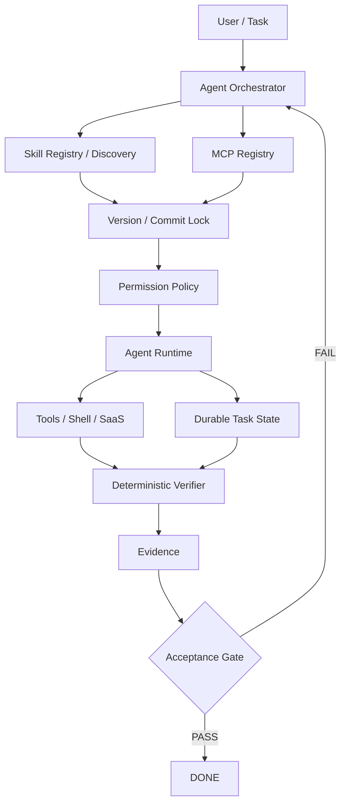

## 01 今日一句话

今天 AI 工程最值得关注的变化是：**Agent Skills / MCP / Harness 已经不只是能力扩展机制，而正在形成一个新的“Agent 依赖与供应链层”**；随之而来的核心问题从“模型够不够聪明”转向“能力如何发现、版本如何固定、权限如何约束、状态如何持久化、结果如何被确定性验证”。

## 02 今日 TOP 5

| 排名 | 项目 / 技术 | 类型 | Stars / 热度 | 近期变化 | 为什么重要 | 评级 | 是否立即研究 |
|---|---|---|---|---|---|---|---|
| 1 | DeepSeek Harness | Agent Harness | 217k+ Stars | 9 月 9 日仍有代码更新 | 插件化 Runtime 把模型、工具、计划、子 Agent、工作流拆成可扩展层 | S | YES |
| 2 | OpenAI Skills | Agent Skills | 26.7k+ Stars | 9 月 8 日仍有更新 | 官方 Skills Catalog 继续验证“能力模块化”正在成为 Coding Agent 的基础抽象 | S | YES |
| 3 | Scanning the Harness | Harness Security Research | 新论文 / 高价值研究 | 9 月 7 日发布，分析 3,171 个公开仓库 | 首次把 skills、hooks、MCP、subagents 作为独立供应链层系统性研究 | S | YES |
| 4 | OKF Agent Memory | Agent Memory | 早期项目 | Git-native、BM25、MCP、Progressive Disclosure | 把长期记忆从黑盒向量库拉回可审计 Git 资产 | A | YES |
| 5 | Reverify | Deterministic Verification | 早期升温 | MCP + CLI + rollover | 用确定性工具裁决 Agent 声明，并把上下文交接持久化 | A | YES |

> Star 数为本次检索时公开 GitHub 数据快照。没有可靠 24h 历史快照的项目，不伪造精确日增量。

## 03 GitHub AI Radar

### 1. deepseek-ai/deepseek-harness

- GitHub: https://github.com/deepseek-ai/deepseek-harness
- Stars / 热度：约 217,458 Stars，25,725 Forks；仓库创建于 2026-08-13，9 月 9 日仍有 push。
- 最近 Release：GitHub `latest release` API 当前未返回正式 Release，项目主要通过主分支持续演进。
- 定位：Agent Harness / Coding Agent Runtime。
- 核心创新：`Everything is a Plugin`，把工具、计划、工作流、子 Agent 等做成插件扩展面。
- 为什么值得关注：同一个模型在不同 Harness 中的能力差异会越来越大，Runtime 本身正在成为长期工程资产。
- 成熟度：Developer Preview / 快速演进。
- 评级：S，原因是技术范式影响、增长速度、工程学习价值都非常高，但稳定性仍需观察。

### 2. openai/skills

- GitHub: https://github.com/openai/skills
- Stars / 热度：约 26,772 Stars，1,795 Forks；9 月 8 日仍有 push。
- 最近 Release：当前以仓库内容持续更新为主。
- 定位：Codex 官方 Skills Catalog。
- 核心创新：把可复用工程流程、工具使用约束和领域知识从全局 Prompt 中拆成独立技能资产。
- 为什么值得关注：Skill 正在成为 Agent 工程的版本化能力单元。
- 成熟度：官方持续维护。
- 评级：S，核心价值不只在 Skill 内容，而在“可分发、可组合、可版本控制”的能力组织方式。

### 3. harness/harness-skills

- GitHub: https://github.com/harness/harness-skills
- Stars / 热度：约 105 Stars、18 Forks，绝对规模小但工程含金量高。
- 定位：Skills + MCP + CI/CD 工作流。
- 核心创新：`AGENTS.md + SKILL.md + MCP Tools` 共同组成真实 CI/CD 操作系统，而不是提示词合集。
- 为什么值得关注：它展示了 Skill 负责“方法”，MCP 负责“能力”，外部系统负责“真实状态”的企业级拆分。
- 成熟度：早期但来自 Harness 官方团队。
- 评级：A。

### 4. okf-memory/okf-agent-memory

- GitHub: https://github.com/okf-memory/okf-agent-memory
- Stars / 热度：约 137 Stars、7 Forks，属于早期项目。
- 定位：Git-native Persistent Agent Memory。
- 核心创新：Markdown + YAML 作为长期知识载体，BM25 本地检索，MCP 暴露查询能力，并强调 Progressive Disclosure。
- 为什么值得关注：它把 Agent Memory 从“数据库能力”重新定义为“可审计、可 review、可 diff 的工程资产”。
- 成熟度：早期。
- 评级：A，创新和可迁移价值高，但基准数据主要来自项目方，需独立验证。

### 5. 2akouwu/reverify

- GitHub: https://github.com/2akouwu/reverify
- 定位：Deterministic Verification + Context Rollover。
- 核心创新：模型只提出 claim，确定性工具基于真实 artifact 给出 VERIFIED / REFUTED；同时通过 rollover 文件把长任务上下文跨 session 保存。
- 为什么值得关注：它把“不要相信 Agent 自己说完成了”实现成工具协议，而不是 Prompt 约束。
- 成熟度：早期。
- 评级：A。

### 6. joshrotenberg/skillet

- GitHub: https://github.com/joshrotenberg/skillet
- Stars / 热度：约 6 Stars，极早期。
- 定位：MCP-native Skill Discovery。
- 核心创新：把分布在 Git 仓库里的 `SKILL.md` 动态索引后，通过 MCP `prompts/list` / `prompts/get` 提供给 Agent，无需预安装全部 Skills。
- 为什么值得关注：它开始解决 Skills 生态真正会遇到的 discovery、trust tier、version pinning、repo graph 问题。
- 成熟度：实验性。
- 评级：B+ / Emerging。

### 7. SUNRNEHUI/agent-harness

- GitHub: https://github.com/SUNRNEHUI/agent-harness
- 当前版本：README 标示 v10.0.0（2026-08-27）。
- 定位：Runtime-neutral Continuity + Acceptance Controls。
- 核心创新：区分 Native / Portable / Audited 三种执行模式，只有跨 session / model 边界时才物化 `contract.json`、`events.jsonl`、`capsule.md`。
- 为什么值得关注：这是一种“按风险决定持久化与审计成本”的 Harness 设计，比所有任务都全量留痕更实用。
- 评级：A。

## 04 Emerging Projects

### OKF Agent Memory

**为什么可能会火：** Agent 长期记忆现在普遍依赖向量数据库或平台私有 Memory，但软件研发场景天然需要 Git diff、review、provenance 和团队协作。Git-native Memory 与现有工程流程契合度高。

**证伪条件：** 如果真实大型代码库中 BM25 / Markdown 结构无法维持检索质量，或者知识维护成本超过收益，这条路线可能只适合小型团队。

### Reverify

**为什么可能会火：** Agentic Coding 最大的工程风险之一是“语言模型自己声明成功”。把 claim 与 deterministic verifier 分离，是从 Prompt Engineering 迈向系统工程的自然步骤。

**证伪条件：** 如果可验证事实覆盖面过窄，只能用于二进制 / 结构事实，而难以扩展到业务语义、行为等复杂判断，增长空间会受限。

### Skillet

**为什么可能会火：** Skills 一旦大量出现，下一步必然出现 registry / discovery / trust / version / dependency 问题。Skillet 已开始用 MCP prompts、版本 pin、repo suggest graph 和 trust tier 解这些问题。

**证伪条件：** 如果 Agent 平台最终都内置统一 Skills Registry，第三方 discovery layer 可能被平台能力吞并。

## 05 今日最值得深挖的项目

### Scanning the Harness：Agent 配置已经是供应链

2026-09-07 发布的论文《Scanning the Harness: An Empirical Study of Supply-Chain Defects in AI Coding-Agent Configurations》分析了 3,171 个公开 GitHub 仓库，包括 2,660 个多组件 Agent 配置和 511 个 Skill Collections。

论文的关键价值不是某个具体百分比，而是提出一个新的工程事实：

```text
Model
  ↓
Harness
  ├─ Instructions
  ├─ Skills
  ├─ Hooks
  ├─ MCP Servers
  └─ Subagents
       ↓
Developer Privileges / Data / Shell / Network
```

过去供应链安全主要关注 npm / Maven / container image；现在 `SKILL.md`、hook、MCP server declaration、agent config 也可能影响 Agent 读取什么、执行什么以及把数据发到哪里。

论文报告的可判定缺陷包括：未固定版本的 MCP Server、看似 scope 很小但实际可触发任意执行的授权模式，以及 Skill 中预授权 shell 的情况。研究未确认 credential-exfiltration path，因此不能把它夸大成“大规模凭据泄露”，但它已经足以证明 Harness 配置需要 lock / scan / policy / review。

**可以迁移到自己的系统：**

1. Skill / MCP / Hook 全部纳入依赖清单。
2. 所有外部组件固定 tag / commit / digest。
3. 安装前扫描 capability 与 shell/network 权限。
4. Runtime 权限和 Skill 描述分离，不能因为 Skill 自称“只读”就授予宽权限。
5. 高风险 Agent 运行引入 deterministic acceptance gate。

### OKF Agent Memory：把 Memory 当作 Git 资产

传统 Agent Memory 常见路径：

```text
Conversation → Embedding → Vector DB → Retrieval
```

OKF Agent Memory 的路径更接近：

```text
Verified Knowledge
      ↓
Markdown + YAML
      ↓
Git History / Review / Provenance
      ↓
BM25 / Index / Graph
      ↓
MCP
      ↓
Agent Working Context
```

最值得借鉴的是 **Search-Before-Write + Progressive Disclosure + Provenance**：写新记忆前先查已有知识；只把当前需要的片段装入上下文；事实附来源和 trust tier。

如果自己实现简化版，核心模块可以只有：`knowledge/` 文件规范、index builder、search CLI、validator、MCP adapter。

## 06 Methodology Radar

### 1. Harness Supply-Chain Security

- 是什么：把 Skills、Hooks、MCP、Subagents、Repository Instructions 视为 Agent 的依赖层。
- 解决问题：防止“允许使用某个 Agent”却无法知道它实际加载了哪些第三方执行能力。
- 为什么现在值得关注：Agent 已拥有 shell、文件、浏览器和 SaaS 权限，配置依赖能够直接参与决策循环。
- 适用：企业 Coding Agent、内部 AI 平台、自动化运维。
- 不适用：完全无工具、无文件写权限的纯问答模型。
- 实践：建立 `agent-lock.yaml`，记录 skill repo commit、MCP package version、hook checksum、permission manifest。

### 2. Deterministic Acceptance Gate

- 是什么：模型负责提出修改和判断，编译器、测试、schema、规则引擎、真实 artifact 负责最终裁决。
- 解决问题：避免 Agent 自我评价形成闭环幻觉。
- 典型项目：Reverify，以及软件研发中的 compiler/test/lint/security scan。
- 适用：代码迁移、重构、接口变更、发布流程。
- 不适用：开放式创意任务。
- 实践：任何 `DONE` 状态必须绑定至少一个机器可验证 evidence。

### 3. Git-native Memory

- 是什么：把长期知识保存在 repository 可 review 的文本资产中，而不是只存在 session 或黑盒数据库。
- 解决问题：跨 session 丢上下文、知识不可审计、团队无法 review Agent Memory。
- 典型项目：OKF Agent Memory。
- 适用：长期软件项目、架构决策、领域知识、操作手册。
- 不适用：需要海量语义召回、跨百万文档检索的场景。
- 实践：从 ADR、business rules、runbook 三类 verified memory 开始。

### 4. Progressive Skill Discovery

- 是什么：Agent 不预装全部 Skill，只先拿 metadata，需要时再加载 Skill body。
- 解决问题：Skill 数量增加后上下文膨胀、发现困难、版本管理困难。
- 典型项目：Skillet、各类 Agent Skills catalog。
- 适用：Skill 数量几十到几百以上的团队。
- 不适用：只有 3～5 个固定 Skill 的简单 Agent。

## 07 Skill Radar

### Skill Card：Harness Dependency Auditor

- Skill 类型：Security / Agent Engineering
- 来源：Scanning the Harness 论文思路
- 解决的问题：检查 repo 中 Agent Skills、MCP、hooks、subagents 的供应链风险。
- 核心思想：Agent 配置也应像 Maven/npm dependency 一样被扫描和锁定。
- 输入：Agent 配置目录、Skill 仓库、MCP 配置。
- 输出：依赖清单、未固定版本、危险权限、shell/network 风险。
- 使用步骤：Discover → Normalize → Pin Check → Capability Scan → Risk Report。
- 适合场景：Claude Code / Codex / Cursor 企业仓库。
- 不适合场景：无工具权限的普通聊天。
- 依赖工具：Git、静态规则扫描、可选 policy engine。
- 可迁移：Claude Code YES / Codex YES / ChatGPT 部分 / OpenCode YES。
- 学习难度：Medium
- 学习价值：★★★★★
- 是否建议收藏：YES
- 是否建议自己实现：YES
- 最小学习实验：扫描自己一个仓库的 `.claude`、`AGENTS.md`、MCP config、Skills，生成 `agent-dependencies.md` 和风险清单。

### Skill Card：Search-Before-Write Memory

- Skill 类型：Memory / Knowledge Workflow
- 来源：OKF Agent Memory
- 解决的问题：避免 Agent 重复写、冲突写、记忆漂移。
- 核心思想：写入长期记忆前必须先检索并判断 update / merge / create。
- 输入：待持久化事实或决策。
- 输出：已有匹配、冲突判断、最终 memory patch。
- 使用步骤：Search → Compare → Verify → Write → Re-index。
- 适合场景：项目知识库、Obsidian/Git 知识库、架构决策。
- 不适合场景：一次性问答。
- 依赖工具：Git + 搜索工具。
- 可迁移：Claude Code YES / Codex YES / ChatGPT YES / OpenCode YES。
- 学习难度：Low
- 学习价值：★★★★★
- 是否建议收藏：YES
- 是否建议自己实现：YES
- 最小学习实验：给项目建 `knowledge/decisions`，让 Agent 在新增 ADR 前强制搜索已有决策。

### Skill Card：Claim → Verify → Evidence

- Skill 类型：Verification Workflow
- 来源：Reverify
- 解决的问题：Agent 对代码、接口、结构、运行结果作无证据声明。
- 核心思想：LLM 提 claim，工具查 artifact，只有 VERIFIED 才进入最终答案。
- 输入：claim + target artifact。
- 输出：VERIFIED / REFUTED + evidence。
- 使用步骤：Extract Claim → Select Verifier → Execute → Attach Evidence → Gate Result。
- 适合场景：代码分析、迁移、测试、逆向、配置审计。
- 不适合场景：主观写作。
- 依赖工具：compiler/test/parser/schema/search。
- 可迁移：Claude Code YES / Codex YES / ChatGPT YES / OpenCode YES。
- 学习难度：Medium
- 学习价值：★★★★★
- 是否建议收藏：YES
- 是否建议自己实现：YES
- 最小学习实验：禁止 Reviewer Agent 直接说 PASS，要求每条验收标准绑定命令输出或 diff evidence。

### Skill Card：Runtime Skill Discovery

- Skill 类型：MCP / Skills
- 来源：Skillet
- 解决的问题：Skill 太多导致预加载上下文巨大。
- 核心思想：metadata 常驻，Skill body 按需通过 MCP prompt 获取。
- 输入：任务描述。
- 输出：候选 Skill + 按需加载内容。
- 使用步骤：Search → Rank → Fetch → Execute → Record Version。
- 适合场景：大型 Skill Library。
- 不适合场景：固定小型 Agent。
- 依赖工具：MCP、Git repositories。
- 可迁移：Claude Code YES / Codex YES / ChatGPT 视 MCP 能力 / OpenCode YES。
- 学习难度：Medium
- 学习价值：★★★★☆
- 是否建议收藏：YES
- 是否建议自己实现：先观察。
- 最小学习实验：用 10 个本地 `SKILL.md` 建一个 BM25 索引，只给 Agent 注入名称和描述，命中后再加载正文。

## 08 Architecture Pattern

### Agent Dependency Control Plane



- 解决的问题：Agent 能力依赖不可见、权限过宽、结果不可验证、session 中断后状态丢失。
- 核心组件：Registry、Lock、Permission Policy、Runtime、Durable State、Verifier、Acceptance Gate。
- 数据流：任务先解析能力依赖并锁定版本，权限策略批准后 Runtime 执行；执行结果进入确定性验证器，只有带 evidence 的 PASS 才完成。
- 状态保存：在 Runtime 外部的 Git / task store，而不是模型会话。
- Agent 交接：下一个 Agent 读取 durable state + evidence + current diff，而不是依赖聊天摘要。
- 失败恢复：根据 checkpoint 重跑未完成步骤，或切换 provider / model。
- 为什么这样设计：把模型变成可替换 worker，把安全、状态和验收放回确定性控制面。

## 09 我今天应该学什么

**MUST LEARN：Harness Supply-Chain Security + Deterministic Acceptance Gate**

如果只有 30～60 分钟：

1. 10 分钟：读《Scanning the Harness》摘要和缺陷分类，理解为什么 Skill/MCP/Hook 是依赖。
2. 15 分钟：检查自己正在使用的 Claude Code / Codex 项目，列出 Skills、MCP、hooks、AGENTS/CLAUDE 指令来源。
3. 15 分钟：把其中一个依赖固定到 tag / commit，并写 capability manifest。
4. 10 分钟：给一个 Coding Agent 任务增加 `DONE requires evidence` 规则。
5. 10 分钟：研究 Reverify 的 `claim → deterministic check → evidence` 思路。

建议源码 / 文档关注：DeepSeek Harness 的插件边界、OpenAI Skills 的 Skill 目录结构、OKF Agent Memory 的 `knowledge/` 与 MCP 层、Reverify 的 verifier / rollover 机制。

## 10 Watchlist

| 项目 | 昨日状态 | 当前状态 | 变化 / 事件 | 趋势 |
|---|---|---|---|---|
| deepseek-ai/deepseek-harness | S / Harness 主线 | 217k+ Stars，9/9 仍有更新 | 继续保持极高关注与开发活跃 | 🔥 Exploding |
| openai/skills | S / Skills 主线 | 26.7k+ Stars，9/8 有更新 | Skills 标准化趋势延续 | ↑ Accelerating |
| harness/harness-skills | A / Emerging | 105 Stars | 规模仍小，但“Skill + MCP + CI/CD”模式价值不变 | → Stable |
| context-mode | A / Context Engineering | 继续观察 | 今日无足够新事件支持升级评级 | → Stable |
| OKF Agent Memory | 新增 | 早期 Git-native memory | 与 Context Engineering / durable state 高度相关 | ↑ Accelerating |
| Reverify | 新增 | deterministic verification + rollover | 命中 Agent 可验证执行核心问题 | ↑ Accelerating |
| Skillet | 新增 | 极早期 Skill Discovery | 关注 registry / trust / version pinning 是否形成生态 | ↑ Accelerating |

## 11 Noise Filter

- **只包装多个模型 API 的“万能 Agent”项目**：如果没有状态管理、权限、验证、工具协议或独特 Runtime 设计，暂不投入时间。
- **纯 Prompt 合集但叫 Skills Marketplace 的项目**：没有版本、触发条件、依赖、测试和验证机制时，工程价值有限。
- **声称精确降低 80% Token / 提升数十倍性能但只有项目方 benchmark 的项目**：可以作为线索，不直接把数字当事实；需要复现实验。
- **只强调“100 个 Agent 并发”的框架**：没有任务状态、冲突控制、evidence、回滚和失败恢复时，多 Agent 数量本身没有意义。

## 12 最终行动清单

- `TODAY`：读 Scanning the Harness，给自己的 Agent 项目做一次依赖与权限盘点。
- `TODAY`：把 `DONE` 改成必须携带 compiler/test/diff evidence。
- `TODAY`：研究 OKF Agent Memory 的 Search-Before-Write 与 Progressive Disclosure。
- `WATCH`：Reverify 的 deterministic verifier 是否扩展到更多软件工程事实类型。
- `WATCH`：Skillet / Skills Registry 是否出现统一版本与信任模型。
- `WATCH`：DeepSeek Harness 插件生态与稳定 API 的形成。
- `SKIP`：没有可验证工程创新的多 Agent Wrapper。

### Sources

- DeepSeek Harness GitHub: https://github.com/deepseek-ai/deepseek-harness
- OpenAI Skills GitHub: https://github.com/openai/skills
- Harness Skills GitHub: https://github.com/harness/harness-skills
- OKF Agent Memory GitHub: https://github.com/okf-memory/okf-agent-memory
- Reverify GitHub: https://github.com/2akouwu/reverify
- Skillet GitHub: https://github.com/joshrotenberg/skillet
- Agent Harness GitHub: https://github.com/SUNRNEHUI/agent-harness
- Scanning the Harness (arXiv, 2026-09-07): https://arxiv.org/abs/2609.07360
- tail.fyi agentic coding radar: https://tail.fyi/
- Reddit community discussion on harness overengineering: https://www.reddit.com/r/AI_Agents/comments/1w8h85a/i_spent_883_commits_and_8_months_building_an_llm/
